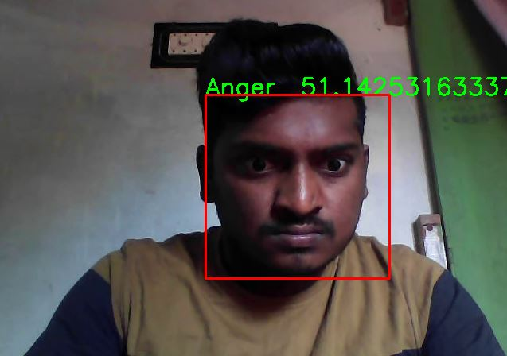
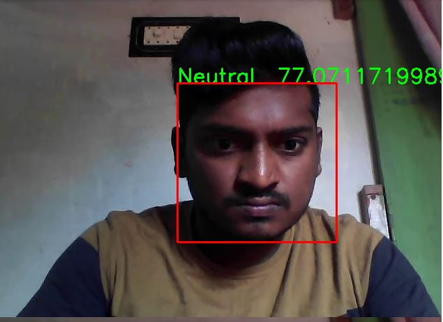
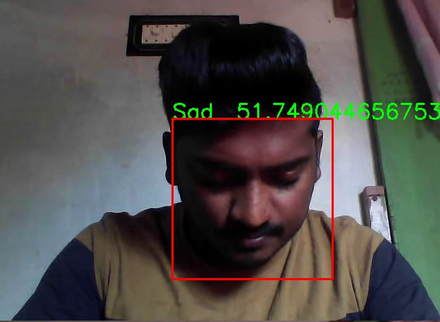

In this project i have used fer dataset to detect facial expressions and classify into 7 categories.
my validation accuracy is 60%
then i implemented this model on webcam using colab api due to some contraints and detected successfully

my model predictions

