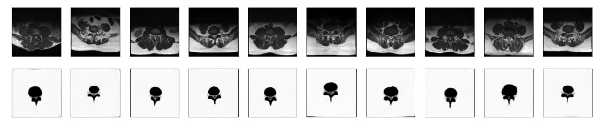
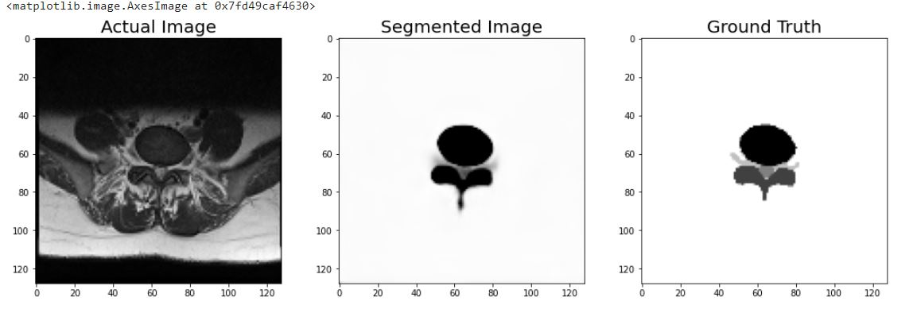

In this project I mainly worked on MRI images of spinal cord.
to detect abnormality in spinal cord images using image segmentation.
For image segmentation i used mainly U-net architecture and it gave me the best results also.
the output project is 

acutal output to the Ground truth

